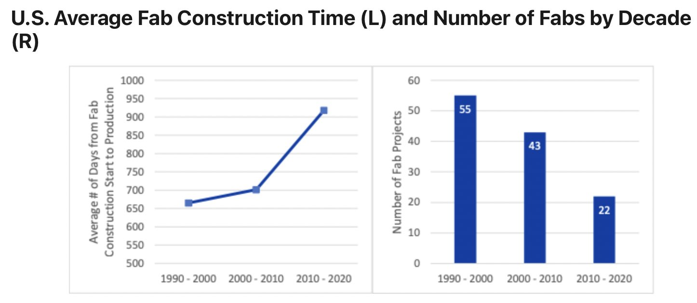

- How do we overcome virality?
- What do we need to create general-purpose [[multi-scale modeling]]?
- How can we make explorable explanations scalable?
- How can we prevent information overload?
- How can we create an emergent internet?
- How can we effectively leverage the wisdom of the crowds?
- What do good user interfaces look like for creating your own feeds/curation engines?
- Before punctuation was invented, we wrote words inalongstreamofletters. What's the 21st century equivalent of punctuation?
- What are the best resources on complex systems?
- Preventing the Collapse of Civilization #[[Jonathan Blow]]
	- {{youtube https://www.youtube.com/watch?v=ZSRHeXYDLko}}
- The War on Sensemaking - [[Daniel Schmachtenberger]]
	- {{youtube https://www.youtube.com/watch?v=7LqaotiGWjQ}}
- Civilization: Instititutions, Knowledge and the Future [[Samo Burja]]
	- {{youtube https://www.youtube.com/watch?v=OiNmTVThNEY}}
- > Another decline of manufacturing process knowledge in America: Between 1990 and 2020, the time required to build a semiconductor fab increased by 38%, from 665 days to 918 days, while the total number of new fabs halved [🔗](https://t.co/WXxMY0NVDE)
	- [Source](https://twitter.com/danwwang/status/1484152159067426819?s=20)
	- 
	-